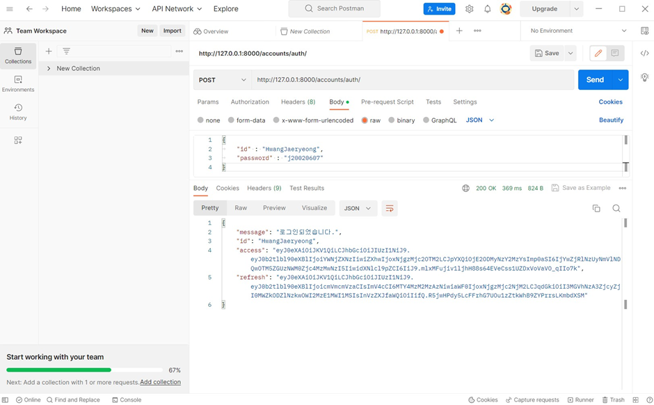
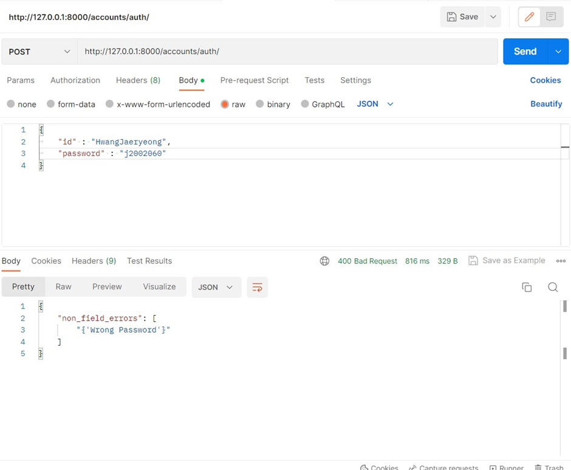
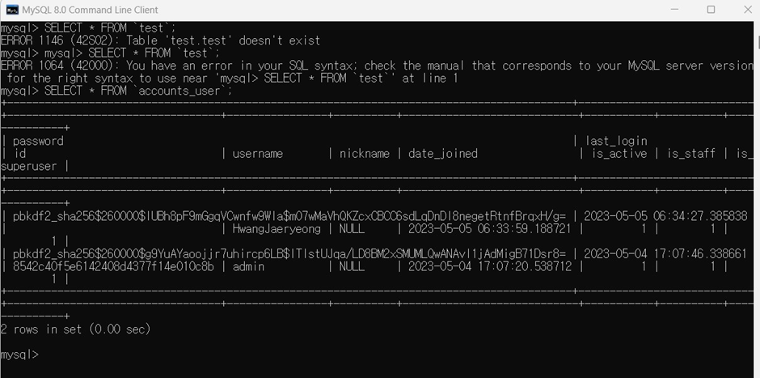

# CEOS 17기 백엔드 스터디

## 3주차 : DRF1 _ Serializer, API View & Filter
### CBV로 API 만들기
  * User
  1) URL : accounts/api/
  2) Method : GET   :  accounts/api/ GET
  
  
```
   [
    {
        "id": 1,
        "username": "홍한",
        "useremail": "andyj0927@kaist.ac.kr",
        "password": "pbkdf2_sha256$260000$wDRdVl1K64ukO0F9BRmThG$m4PBhq6XQLg8IhTpKBB8QHlF0Og+cA2LNEc7nMj3XsQ=",
        "created_at": "2023-03-31T20:57:57.107502+09:00",
        "updated_at": "2023-03-31T20:57:57.107502+09:00"
    },
    {
        "id": 2,
        "username": "재령",
        "useremail": "jrjwjy@naver.com",
        "password": "pbkdf2_sha256$260000$ZOrdbXrInxAqpErypYnHp2$QCM3lwEg4CK68FTFnBJFxtJRQWe9TML8AkTMJ1U/34c=",
        "created_at": "2023-03-31T20:58:49.109280+09:00",
        "updated_at": "2023-03-31T20:58:49.109280+09:00"
    }
]
```

  * 특정 데이터를 가져오는 API 만들기
    
    1) URL : accounts/api/<int:pk>/
    2) Method : GET   :  : accounts/api/2/ GET
```
 {
    "id": 2,
    "username": "재령",
    "useremail": "jrjwjy@naver.com",
    "password": "pbkdf2_sha256$260000$ZOrdbXrInxAqpErypYnHp2$QCM3lwEg4CK68FTFnBJFxtJRQWe9TML8AkTMJ1U/34c=",
    "created_at": "2023-03-31T20:58:49.109280+09:00",
    "updated_at": "2023-03-31T20:58:49.109280+09:00"
}
```
  * 새로운 데이터를 create하도록 요청하는 API 만들기
    1) URL : accounts/api/
    2) Method : POST
    3) Body:
```
{
        "id": 5,
        "username": "새로운 유저",
        "useremail": "new@naver.com",
        "password": "new1111",
        "created_at": "2023-04-06T23:02:07.391585+09:00",
        "updated_at": "2023-04-06T23:02:07.391585+09:00"
    }
```

  * 특정 데이터를 삭제 또는 업데이트하는 API
    1) URL : accounts/api/<int:pk>/
    2) Method : `DELETE` : :accounts/api/3/ DELETE
    
    


## 새롭게 알게 된 것
  * Json 형식으로 보는 법
```
  REST_FRAMEWORK = {
    'DEFAULT_RENDERER_CLASSES': (
        'rest_framework.renderers.JSONRenderer',
    )
}
```

  * 인터페이스 형식으로 보는 법
```
REST_FRAMEWORK = {
    'DEFAULT_RENDERER_CLASSES': (
        'rest_framework.renderers.Renderer',
    )
}
```

## Viewset으로 리팩토링하기
Board, Comment Viewset
```
class BoatdViewSet(mixins.ListModelMixin, viewsets.GenericViewSet):
    serializer_class = PostSerializer
    queryset = Board.objects.all()
    filter_backends = [DjangoFilterBackend]
    filterset_class = BoardFilter

class CommentViewSet(viewsets.ModelViewSet):
    serializer_class = CommentSerializer
    queryset = Comment.objects.all()
```
URL 매핑
```
router = routers.DefaultRouter()
router.register(r'board', BoardViewSet)
router.register(r'comments', CommentViewSet)

urlpatterns = router.urls
```

### filter 기능 구현하기
BoardFliter
```
class BoardFilter(FilterSet):
    writer = filters.CharFilter(method='filter_user')
    contents = filters.CharFilter(field_name='contents', lookup_expr='icontains')

    class Meta:
        model = Board
        fields = ['writer', 'contents']

    def filter_user(self, queryset, name, value):
        return queryset.filter(**{
            name: value,
        })
```

## 내용 정리
filter()의 조건 키워드
### 키워드 앞에 쓰이는 `__`

- 조건을 사용할 떄
- 외부 모델 필드를 사용할 때
### contains / icontains

지정한 문자열을 포함하는 자료 검색

`queryset.filter(title__contains='hi')`

`queryset.filter(title__icontains='hi')` icontains는 대소문자 구별하지 않음

### exact / iexact

정확히 일치하는 자료 검색

`queryset.filter(title__exact='hi')`

`queryset.filter(title__iexact='hi')` iexact는 대소문자 구별하지 않음

### startswith / endswith

지정한 문자열로 시작하는[끝나는] 자료 검색

`queryset.filter(title__startswith='hihi')`

`queryset.filter(title__istartswith='hihi')` istartswith는 대소문자 구별하지 않음

**회고**

View를 계속 리팩토링하는 것이 코드의 길이가 줄어드는 게 보여서 장고가 간단하고 편리한 툴이라고 다시 생각했다 !

시험기간이라서 뭔가 촉박하게 과제를 마무리한 것 같은데 다음 과제부터는 공부도 꼼꼼하게 하면서 많은 기능들을 더 많이 구현해보고 싶다


----
## 4주차 : DRF2 _ Simple JWT & Permission
### 로그인 인증 방식에는 어떤 것이 있을까?
+) 인증을 해야하는 이유
  
  HTTP는 기본적으로 stateless, connectionless하기 때문에 모든 요청(Request)이 이전 요청과 독립적으로 다뤄진다.
  요청이 끝날 때마다 서버는 유저에 대한 정보를 잊어버리게 되기 때문에 요청 시마다 클라이언트는 서버에 인증을 해야 한다.
  
#### Header
HTTP Request Header에 인증 수단인 비밀번호를 직접 넣는 방식이다.
보통 서버로 HTTP 요청을 할 때 암호화를 하지 않기 때문에 보안적으로 매우 치명적이다.
만약 해커가 HTTP 요청을 볼 수 있다면 사용자의 계정 정보를 쉽게 알 수 있다.

- 장점
  - 인증 테스트 때 사용 가능
- 단점
  - 보안 매우 취약
  - 요청 시마다 서버에 ID, PW 대조 필요
-----
#### Session, Cookie
*Session: 서버가 가지고 있는 정보
*Cookie: 사용자에게 발급된 세션을 열기 위한 열쇠

Session, Cookie 방식은 Session ID를 만드는 세션 저장소를 사용하는 방식이다.
Session ID는 로그인을 했을 때 사용자의 정보를 저장하는 것으로 HTTP Header에 실려 사용자에게 보내진다.
사용자는 보관하고 있던 쿠키를 인증이 필요한 요청에 넣어 보내고 서버는 세션 저장소에서 쿠키와 기존 정보를 비교하여 인증한다.
세션을 사용하여 인증하여 책임을 서버가 지게 한다고 볼 수 있다.(사용자보다는 서버 해킹이 더 어렵기 때문)

- 장점
  - Header 방식과는 다르게 HTTP 요청이 노출되더라도 안전하다. 사용자의 정보는 세션 저장소에 저장되고 HTTP 요청에 들어있는 쿠키 자체는 유의미한 정보가 없기 때문이다.
  - 사용자는 각각 고유한 Session ID를 발급 받아 회원 정보 확인이 매번 필요하지 않기 때문에 서버 자원에 접근이 용이하다.
- 단점
  - Session Hijacking 공격 가능
    세션을 가로채서 별도의 인증 작업 없이 세션을 통해 통신을 계속하는 행위를 말한다. HTTPS 프로토콜을 사용하거나 세션에 만료 시간을 설정하는 방식으로 해결 가능하다.
  - 세션 저장소를 사용하기 때문에 별도의 저장공간이 필요하다.
-----
#### Access Token (JWT)

- 장점
  - 세션 쿠키 방식과 달리 저장소를 사용하지 않기 때문에 별도의 저장공간이 필요 X
  - 서명에는 송신자와 송신한 정보들에 대한 내용이 포함되어 있어 서버에서 데이터 조작 및 변조 여부를 알아낼 수 있다.
- 단점
  - Token이 발급되면 만료시간 전까지 계속 사용할 수 있기 때문에 세션 쿠키 방식과 같이 해커가 토큰을 가로채서 사용할 수 있다. Refresh Token을 발급하여 사용하는 방식으로 해결 가능
  - Payload는 따로 암호화하지 않기 때문에 담을 수 있는 정보가 제한적이다.
  - Token의 길이가 길어 요청이 많아질수록 서버의 자원 낭비가 생긴다.
-----
#### Access Token, Refresh Token
*Refresh Token: Access Token과 같은 형태의 JWT이다. Access Token보다 긴 유효기간을 가지며 Access Token 만료 시에 새로 발급을 도와준다.

Refresh Token을 사용하여 사용자가 자주 로그인을 해야 하는 상황이나 장기간 로그인했을 때 발생하는 보안적 문제점들을 해결하였다.

- 장점
  - 유효 기간이 더 짧기 때문에 Access Token만 단독으로 사용하는 경우보다 보안적으로 더욱 안전하다.
- 단점
  - 구현이 복잡하다.
  - 서버의 자원 낭비가 생긴다.
-----
#### OAuth 2.0
- 장점
  - 직접 타사 사용자의 정보를 입력하는 것보다 안정적이다.
  - 회원 정보뿐만 아니라 기타 API에 대한 정보에도 접근이 가능하다.
- 단점
  - 구현이 매우 복잡하다.
-----
### JWT(JSON Web Token)란 무엇인가?
통신 양자간의 정보를 JSON 형식을 사용하여 안전하게 전송하기 위한 방법


  
  - Header
    - alg: 서명 암호화 알고리즘
    - typ: 토큰 유형
  - Payload
    토큰에서 사용할 정보의 조각들인 Claim이 담겨있음
    *Claim: key-value 형식으로 이루어진 한 쌍의 정보
  - Signature
    시그니처에서 사용하는 알고리즘은 헤더에서 정의한 알고리즘 방식(alg)을 활용
    시그니처의 구조는 (헤더 + 페이로드)와 서버가 갖고 있는 유일한 key 값을 합친 것을 헤더에서 정의한 알고리즘으로 암호화


### JWT 로그인 구현하기
1. Custom User Model 사용
  ```python
    # models.py
    class User(AbstractBaseUser, PermissionsMixin):
        objects = UserManager()

        id = models.CharField(primary_key=True, max_length=17, verbose_name="id", unique=True)
        username = models.CharField(max_length=17, verbose_name="아이디", unique=True)
        nickname = models.CharField(max_length=100, verbose_name="이름", null=True)
        date_joined = models.DateTimeField(auto_now_add=True, verbose_name='가입일', null=True, blank=True)

        is_active = models.BooleanField(default=True)
        is_staff = models.BooleanField(default=False)
        is_superuser = models.BooleanField(default=False)

        USERNAME_FIELD = 'username'
        REQUIRED_FIELDS = []


        def __str__(self):
            return self.username 
  ```

2. 로그인 구현
```python
    # serializer.py
    class RefreshToken(RefreshToken):
        def for_user(cls, user):
            token = super().for_user(user)
            return token


    class LoginSerializer(serializers.Serializer):
    id = serializers.CharField(write_only=True, required=True)
    password = serializers.CharField(write_only=True, required=True)

    def validate(self, request, username=None):
        id = request.get('id', None)
        password = request.get('password', None)

        if User.objects.filter(username=id).exists():
            user = User.objects.get(username=id)
            if not user.check_password(password):
                raise serializers.ValidationError({"Wrong Password"})
        else:
            raise serializers.ValidationError({"User doesn't exist."})

        token = RefreshToken().for_user(user)
        refresh = str(token)
        access = str(token.access_token)

        data = {
            'id': user.username,
            'refresh': refresh,
            'access': access
        }

        return data
```

```python
#views.py
class AuthView(APIView):
 serializer_class = LoginSerializer

 def post(self, request, username=None):
     serializer = self.serializer_class(data=request.data)

     if serializer.is_valid(raise_exception=False):
         id = serializer.validated_data['id']
         access = serializer.validated_data['access']
         refresh = serializer.validated_data['refresh']
         # data = serializer.validated_data
         res = Response(
             {
                 "message": "로그인되었습니다.",
                 "id": id,
                 "access": access,
                 "refresh": refresh
             },
             status=status.HTTP_200_OK,
         )
         return res

     return Response(serializer.errors, status=status.HTTP_400_BAD_REQUEST)
```




### 에러 해결

- postman 사용시에 에러가 많이 나서 시간이 꽤 걸렸던 거 같습니다 ㅠㅅㅠ
1. 
```
{
    "id": [
        "Must be a valid UUID."
        ]
}
```
-> uuid 형식과 serializer의 charfield 형식이 맞지 않아 발생한 오류

2.

HwangJaeryeong이라는 게 id가 아니라 username으로 저장되어 있었고, postman에서 가져오려고 하는 건 아이디에 저장된 값을 불러오려고 하고 있어서 filter(id=id)로 찾을 때 안나와서 계속 user가 존재하지 않는다는 에러가 떴었습니다.
따라서 (username=id)로 filter code를 변경해주고, 
```
data = {
         'id': user.username,
         'refresh': refresh,
         'access': access
     }
```
data를 이렇게 반환해주니 user를 찾지 못하는 에러는 해결되었습니다. 

### 회고
은근 에러가 많이 나서 시간이 꽤 오래걸렸다..😩 
코드 짜면서도 내 코드가 비효율적인 것 같아서 리팩토링을 다시 하고 싶다
이번 과제에서는 다시 APIView와 as_view()를 사용해서 두 가지 코드 형식이 함께 있는게 적절한지는 모르겠지만 어찌저찌 끝냈다 !-!